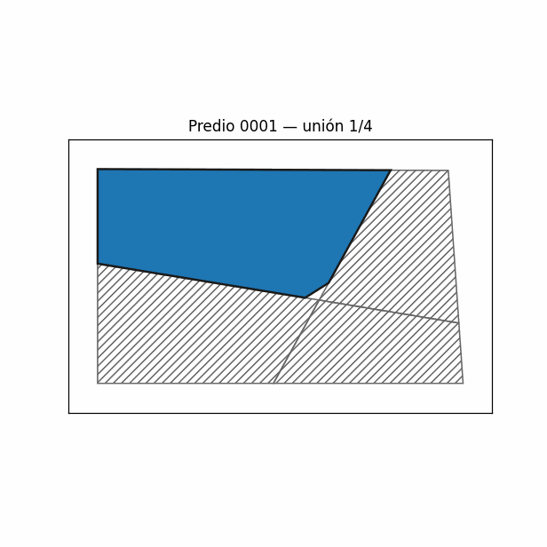
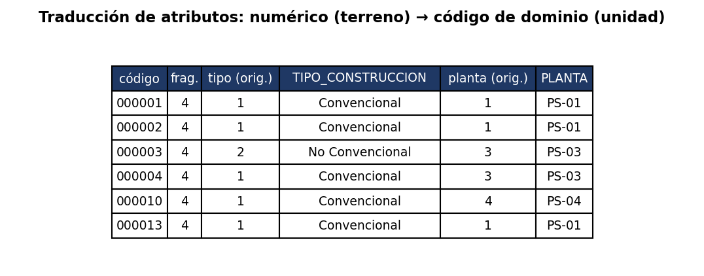

# 01 · Fusión y unificación topológica de polígonos

En cartografía catastral un mismo predio suele quedar dividido en **varios
fragmentos** durante la digitalización. Hay que consolidarlos en un único
polígono por identificador —sin huecos ni solapes— y llevar sus atributos a la
capa de unidades **traduciendo los campos numéricos a los códigos de dominio** de
destino.

## Reglas

**Fusión geométrica:** se toma el fragmento de mayor área como base y se hace
unión progresiva del resto (`unary_union`). Un polígono por predio al final.

**Traducción de atributos:**

| Campo en terreno (numérico) | Campo en unidad (dominio) |
|---|---|
| `tipo` = 1 | `TIPO_CONSTRUCCION` = `Convencional` |
| `tipo` = 2 | `TIPO_CONSTRUCCION` = `No Convencional` |
| `planta` = 3 | `PLANTA` = `PS-03` |

(Normaliza `2`, `"2"`, `2.0`, `"02"`; respeta valores ya codificados `PS-`/`MZ-`/`ST-`.)

## Proceso, paso a paso

| Paso | Qué se hace |
|------|-------------|
| 1 | Agrupar los fragmentos por código de predio. |
| 2 | Ordenar por área; el mayor es la base. |
| 3 | **Unión progresiva** del resto sobre la base. |
| 4 | Un polígono por código; se descartan los fragmentos consumidos. |
| 5 | Migrar atributos, **traduciendo numérico → dominio**. |



## Resultado (datos sintéticos)


Bloque sintético de 30 predios; 12 estaban fragmentados (56 fragmentos en total).
A la izquierda se ven las líneas internas de los cortes de digitalización; a la
derecha, un único polígono por código.



## Ejecutar

```bash
python codigo/fusion_poligonos.py
```

Requiere `numpy`, `pandas`, `matplotlib`, `shapely`, `Pillow`. No usa arcpy ni QGIS.

## Datos de muestra

- [`datos_muestra/fragmentos.geojson`](datos_muestra/fragmentos.geojson) — entrada (predios troceados)
- [`datos_muestra/unidades.geojson`](datos_muestra/unidades.geojson) — salida (predios unificados + atributos de dominio)

## Nota

Versión generalizada y con datos sintéticos de una herramienta de producción
(ArcGIS Python toolbox) usada en catastro multipropósito. Sin identificadores de
cliente, sin rutas reales, sin datos reales.
