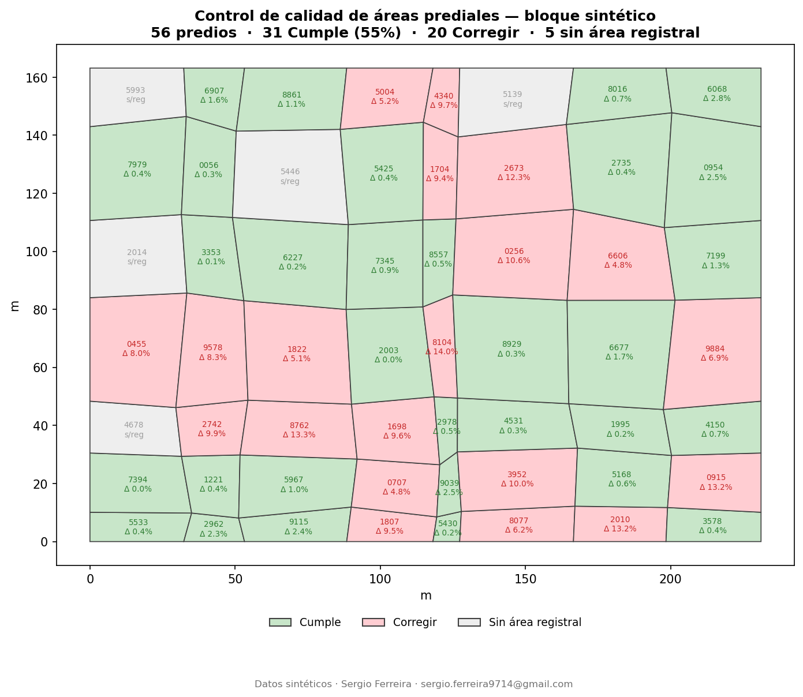

# 02 · Control de calidad espacial con bandas de tolerancia

Verificar, sobre todo un bloque catastral, si el **área calculada
geométricamente** coincide —dentro de una tolerancia— con el **área registral**
(la del folio de matrícula), y marcar automáticamente los predios que deben
corregirse.

## Regla de negocio

`Diferencia_% = |área_geométrica − área_registral| / área_registral · 100`

La tolerancia depende del tamaño del predio (más estricta cuanto mayor es):

| Área registral | Tolerancia |
|---|---|
| ≤ 80 m² | 7 % |
| ≤ 250 m² | 6 % |
| ≤ 500 m² | 4 % |
| > 500 m² | 3 % |

Veredicto: **Cumple** · **Corregir** · **Sin Área Registral**.

## Proceso, paso a paso

| Paso | Qué se hace |
|------|-------------|
| 1 | Cruce de la capa de predios con la fuente registral por número predial. |
| 2 | Cálculo del área geométrica de cada predio. |
| 3 | Cálculo de la diferencia porcentual frente al área registral. |
| 4 | Selección de la banda de tolerancia según el tamaño y **veredicto automático**. |
| 5 | Salidas: **mapa temático** + **reporte Excel de auditoría** (ordenado por desviación). |

## Resultado (datos sintéticos)



56 predios de un bloque sintético con errores inyectados: 31 Cumple, 20 Corregir,
5 sin área registral. Las mayores desviaciones (12–14 %) se concentran, como es
esperable, en los predios grandes, donde la tolerancia es del 3 %.

Reporte de auditoría: [`salidas/reporte_qc.xlsx`](salidas/reporte_qc.xlsx)
(cabecera con formato, filas coloreadas por veredicto, ordenadas por diferencia).

## Dos implementaciones, misma regla

- **Python autónomo** — [`codigo/qc_areas.py`](codigo/qc_areas.py)
  Genera el bloque sintético, corre el control y produce el mapa y el Excel.
  Requiere `numpy`, `pandas`, `matplotlib`, `shapely`, `openpyxl`. No usa arcpy ni QGIS.

  ```bash
  python codigo/qc_areas.py
  ```

- **PostGIS** — [`postgis/qc_areas.sql`](postgis/qc_areas.sql)
  La misma lógica como función + vista. El área geométrica se calcula con
  `ST_Area()` **en vivo** en cada consulta, así nunca queda desactualizada tras
  editar la geometría en QGIS:

  ```sql
  SELECT evaluacion, count(*) FROM qc_areas GROUP BY evaluacion;
  SELECT * FROM qc_areas WHERE evaluacion = 'Corregir' ORDER BY diferencia_pct DESC;
  ```

## En producción

Esta misma regla de tolerancias es uno de los reportes de un **sistema completo
de auditoría de calidad** (FastAPI + PostGIS/SQLite, ingesta de GDB, 8
validaciones automáticas, panel web e informe estático) que diseñé y desarrollé
para un proyecto real. → **[Caso 04](../04-sistema-auditoria-calidad/)**

## Datos de muestra

- [`datos_muestra/predios.geojson`](datos_muestra/predios.geojson) — geometría sintética generada
- [`datos_muestra/registral.csv`](datos_muestra/registral.csv) — tabla registral sintética (con errores)

Todo sintético. Ningún dato real de cliente.
