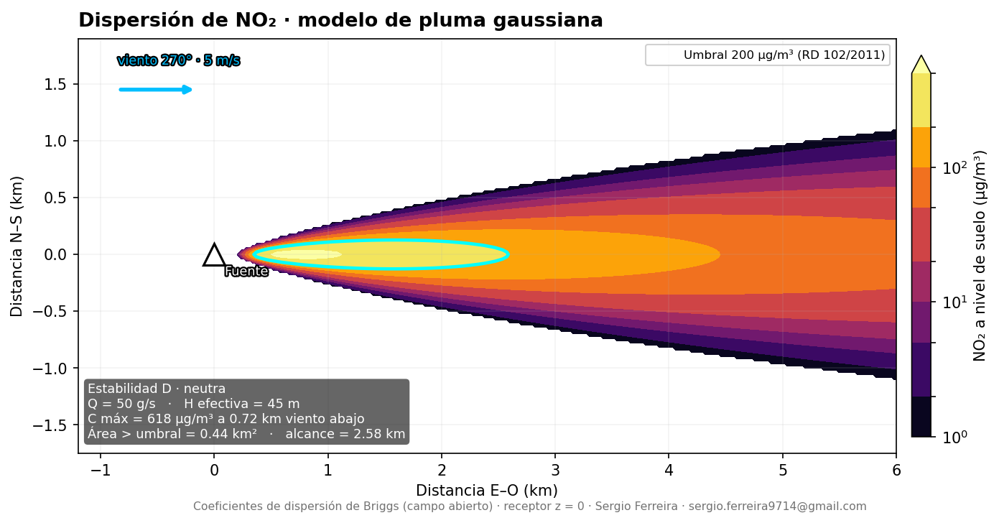
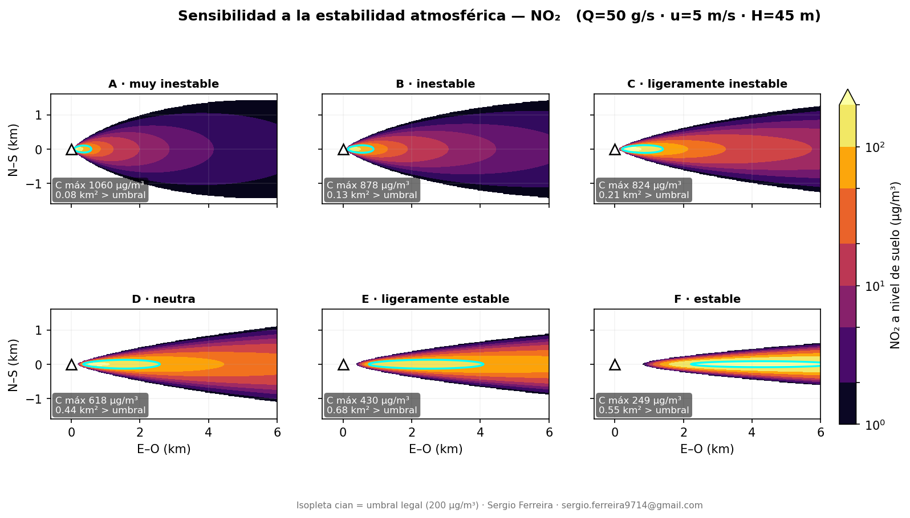
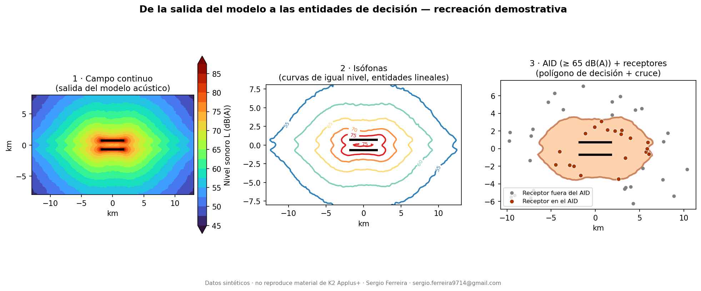

# 03 · Modelación ambiental → entidades SIG

Cómo se pasa de un **modelo físico** (dispersión de un contaminante, propagación
de ruido) a **cartografía y entidades geográficas** con las que se toman
decisiones sobre el área de influencia de un proyecto.

Dos partes:

- **A. Pluma gaussiana** — modelo propio, reproducible, de principio a fin.
- **B. Componente SIG en un estudio de ruido aeroportuario** — rol desempeñado en
  un proyecto real de K2 Applus+ (descrito y acreditado a la empresa; el
  entregable original no se reproduce).

---

## A. Modelo de pluma gaussiana

Emisión continua desde una fuente puntual (chimenea). Se calcula la
concentración a nivel de suelo sobre una malla regular y se reduce a isopletas
comparables con un umbral legal.

**Ecuación** (Turner, 1994; reflexión total en el suelo, receptor a `z = 0`):

```
C(x,y) = Q / (pi · u · sy · sz) · exp(-y² / (2·sy²)) · exp(-H² / (2·sz²))
```

con `sy`, `sz` (coeficientes de dispersión de Briggs, campo abierto) en función
de la distancia a favor del viento y de la clase de estabilidad Pasquill-Gifford.

### Proceso, paso a paso

| Paso | Qué se hace |
|------|-------------|
| 1 | **Definir la fuente y la meteorología**: caudal másico `Q`, altura efectiva `H`, velocidad y dirección del viento, clase de estabilidad. |
| 2 | **Construir la malla** de receptores y calcular `sy`, `sz` para cada celda según su distancia a favor del viento. |
| 3 | **Aplicar la ecuación gaussiana** → campo continuo de concentración a nivel de suelo. |
| 4 | **Trazar isopletas** y superponer el **umbral legal** (NO₂ horario, 200 µg/m³ — RD 102/2011 / Directiva 2008/50/CE). Métricas: concentración máxima, distancia a la que ocurre, área y alcance por encima del umbral. |
| 5 | **Exportar a raster** (`.asc`) para abrirlo en QGIS/ArcGIS y cruzarlo con población, usos del suelo y receptores sensibles. |

### Resultado



Escenario: `Q` = 50 g/s de NO₂, chimenea de `H` = 45 m, viento del oeste a 5 m/s,
atmósfera neutra (clase D).

| Métrica | Valor |
|---|---|
| Concentración máxima a nivel de suelo | 618 µg/m³ a 0,72 km viento abajo |
| Área por encima del umbral (200 µg/m³) | 0,44 km² |
| Alcance del umbral | 2,58 km |

Concentración ≈ 0 en la base de la chimenea (penacho elevado), pico a ~700 m,
luego dilución.

### Análisis de sensibilidad



La misma emisión bajo las seis clases de estabilidad. Atmósfera inestable →
penacho ancho y diluido, pico alto cerca de la fuente. Atmósfera estable →
penacho estrecho, concentrado y de largo alcance.

### Ejecutar

```bash
python codigo/pluma_gaussiana.py
```

Solo requiere `numpy` y `matplotlib`. Genera las dos figuras y el raster `.asc`.
No usa software propietario.

---

## B. Componente SIG · Estudio de ruido — Aeropuerto El Dorado · K2 Applus+

**Estudio, modelación acústica y cartografía: © K2 Applus+.**
La imagen original del estudio **no se reproduce** en este repositorio.

**Mi aporte — componente SIG:** creación de las entidades físicas para proyectar
los efectos del proyecto sobre el **Área de Influencia Directa (AID)** a partir de
la salida del modelo acústico:

- Conversión de las **isófonas** del modelo (curvas de igual nivel dB(A)) en
  polígonos topológicamente consistentes.
- **Delimitación del AID** y su geometría a partir de los umbrales acústicos.
- **Cruce espacial** con límites administrativos, coberturas, predios y
  **receptores sensibles** (viviendas, equipamientos), y generación de las
  tablas de elementos afectados.

### Por qué está aquí

Un estudio de ruido y un modelo de dispersión son la misma familia de problema:
un **campo continuo** (dB(A) o µg/m³) que se reduce a **curvas de umbral** y luego
a **entidades geográficas** para decidir. En estos proyectos hay dos roles
distintos —el que corre el modelo físico y el que construye las entidades SIG y
hace el análisis territorial— y este es el segundo.

### Recreación demostrativa del método

Versión **100 % sintética y rotulada como tal**. No reproduce ni deriva de ningún
entregable de K2 Applus+; solo ilustra el flujo de trabajo SIG.



| Paso | Qué se hace | Entidad resultante |
|------|-------------|--------------------|
| 1 | Campo continuo de nivel sonoro (salida del modelo acústico) sobre malla regular | ráster dB(A) |
| 2 | Trazado de **isófonas** a 55/60/65/70/75 dB(A) | líneas |
| 3 | **AID** = región por encima del umbral de impacto (aquí ≥ 65 dB(A)) | polígono |
| 4 | **Cruce** del AID con receptores sensibles (viviendas, colegios, hospitales…) | tabla de afectación |


En el escenario sintético: AID de 73 km², 19 de 50 receptores dentro
(17 viviendas + 1 colegio + 1 centro comunitario).

**Ejecutar:** `python codigo/isofonas_aid.py` (numpy, pandas, matplotlib, shapely).

Salidas: [`salidas/isofonas_aid.png`](salidas/isofonas_aid.png) ·
[`salidas/proceso_isofonas.png`](salidas/proceso_isofonas.png) ·
[`salidas/receptores_afectados.csv`](salidas/receptores_afectados.csv) ·
GeoJSON de isófonas, AID y receptores en [`datos_muestra/`](datos_muestra/).
