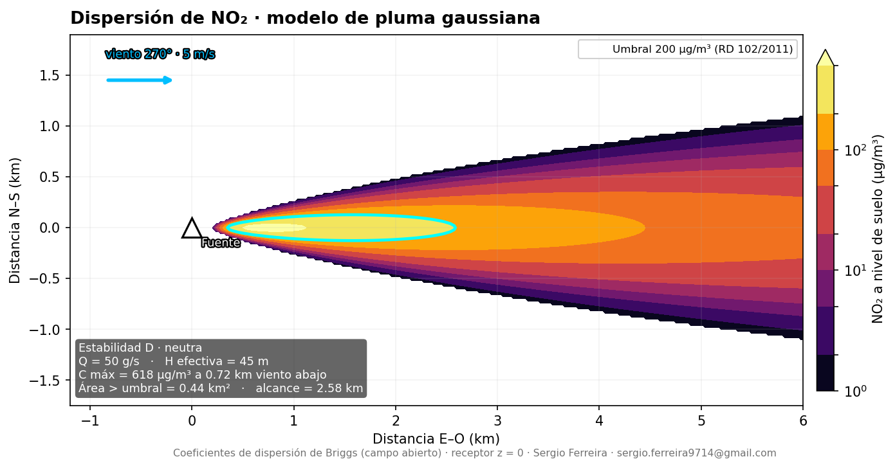
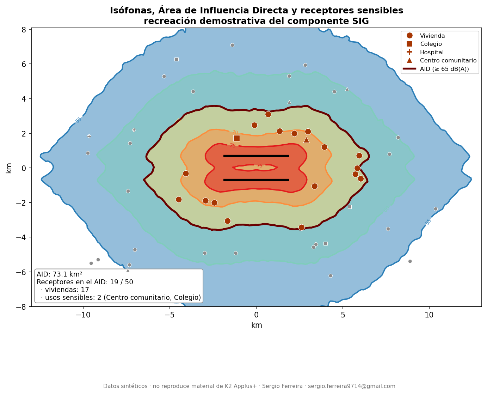
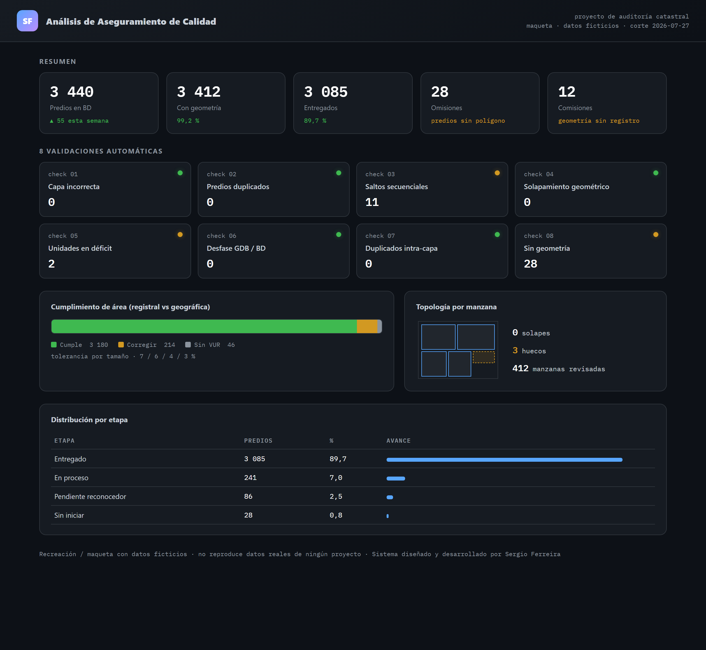
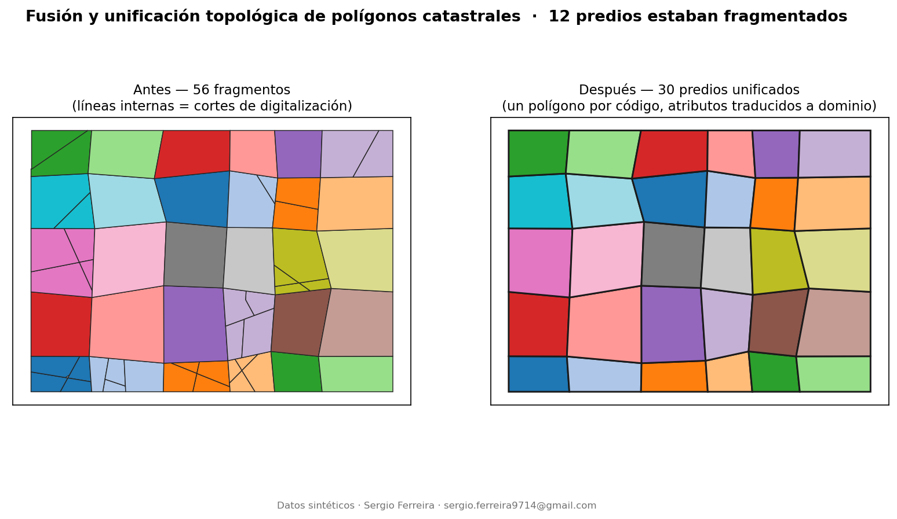

# Sergio Ferreira — Portafolio SIG

**Analista SIG.** Modelación espacial ambiental, control de calidad de datos
espaciales y automatización de geoprocesamiento. Trabajo indistintamente en
**ArcGIS** (arcpy / Python toolboxes) y **QGIS / PostGIS**, sin depender de una
licencia concreta.

> *GIS analyst — environmental spatial modelling, spatial data quality and
> geoprocessing automation. Dual stack ArcGIS / QGIS + PostGIS.*

Todo el código de este repositorio es reproducible y usa **datos sintéticos**:
sin identificadores de cliente, sin rutas reales, sin datos reales. Los trabajos
hechos para terceros se describen y se acreditan a su titular.

---

## Modelación ambiental → entidades SIG

Del modelo físico a la cartografía de decisión.

**A. Pluma gaussiana** — modelo propio de dispersión de contaminantes
atmosféricos, de principio a fin, reproducible sin software propietario.

**B. Componente SIG en un estudio de ruido aeroportuario** (K2 Applus+) —
recreación demostrativa del flujo **campo continuo → isófonas → Área de
Influencia Directa → cruce con receptores sensibles**.

**[Ver caso →](01-modelacion-ambiental/)**

## Sistema de auditoría de calidad de datos espaciales

Aplicación full-stack de aseguramiento de calidad: **FastAPI** (~84 endpoints),
**motor dual PostgreSQL/PostGIS o SQLite+shapely**, ingesta de geodatabase con
arcpy, 8 validaciones automáticas, panel web e informe estático.

Diseñado y desarrollado de extremo a extremo para un proyecto de auditoría
catastral · ~14.800 líneas de Python · se publica solo la ficha y una maqueta con
datos ficticios.
**[Ver caso →](02-sistema-auditoria-calidad/)**

## Fusión y unificación topológica de polígonos

Consolidar los fragmentos de un predio en un único polígono por identificador y
migrar los atributos traduciendo los campos numéricos a códigos de dominio.

Unión progresiva por área · traducción `1/2 → Convencional/No Convencional`,
`3 → PS-03` · deduplicación en re-ejecuciones.
**[Ver caso →](03-fusion-poligonos-catastro/)**

## Control de calidad espacial con bandas de tolerancia

Comparar el área geométrica con el área registral, aplicar una tolerancia según
el tamaño del predio y emitir un veredicto automático **Cumple / Corregir**.

Reporte Excel de auditoría · misma regla implementada también en **PostGIS**
(`ST_Area` en vivo) · es además uno de los reportes del sistema de auditoría.
**[Ver caso →](04-control-calidad-espacial/)**

---

## Stack

| | |
|---|---|
| **Lenguaje** | Python (numpy, pandas, matplotlib, shapely) |
| **SIG** | ArcGIS Pro (arcpy, Python toolboxes `.pyt`), QGIS (PyQGIS, Processing) |
| **Datos espaciales** | PostgreSQL / PostGIS, File Geodatabase, GeoJSON, raster ASCII |
| **Backend / web** | FastAPI, uvicorn, SQLite, Leaflet |
| **Aplicación** | evaluación de impacto ambiental (calidad del aire, ruido) · catastro multipropósito · ordenamiento territorial |

## Cómo ejecutar

Cada caso trae su propio `codigo/` y se ejecuta con
`python codigo/<script>.py`. Dependencias: `numpy pandas matplotlib shapely
openpyxl Pillow`. No requiere ArcGIS ni QGIS instalados.

## Contacto

**Sergio Ferreira** · sergio.ferreira9714@gmail.com ·
GitHub [@sergioferreira9714-spec](https://github.com/sergioferreira9714-spec)
